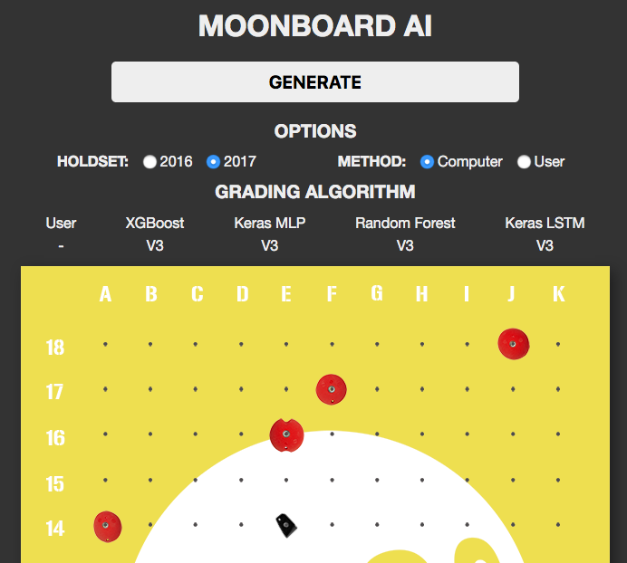

# Moon Board Climbing

### What is it?

It's a way to create new climbs for the [moon board](https://www.moonboard.com/) and grade climbs using machine learning!

## Setup

1. Clone the repo
2. Install python dependencies by running:
```sh
virtualenv -p python3.7 venv
source venv/bin/activate
pip install -r requirements.txt
```
3. Add the project directory to the PYTHONPATH so that imports work
```sh
export PYTHONPATH=$(pwd)
```
Note: On Windows set `PythonPath` environment variable to the project folder. [See Instructions here](https://www.codingdefined.com/2015/09/how-to-set-up-pythonpath-in-windows-10.html)


## Automatic Climb Grading
#### Instructions
Run the grading script. Takes about 5 minutes on my desktop.
```sh
python moon/analytics/configuration.py
```
**Expected output**
```
Using TensorFlow backend.
Generated 22 configruations.
Training Configuration: XGBoost         Climbset=2016 X=Flanders      Y=Flanders       Trained in 6.16s
Training Configuration: Random Forest   Climbset=2016 X=Flanders      Y=Flanders       Trained in 1.87s
Training Configuration: Keras LSTM      Climbset=2016 X=Categorical   Y=Categorical    Trained in 29.92s
Training Configuration: Keras MLP       Climbset=2016 X=Categorical   Y=Categorical    Trained in 5.76s
Training Configuration: Random Forest   Climbset=2016 X=Categorical   Y=Categorical    Trained in 3.98s
Training Configuration: Keras LSTM      Climbset=2016 X=Split         Y=Split          Trained in 29.39s
Training Configuration: Keras MLP       Climbset=2016 X=Split         Y=Split          Trained in 5.49s
Training Configuration: Random Forest   Climbset=2016 X=Split         Y=Split          Trained in 1.57s
Training Configuration: Keras LSTM      Climbset=2016 X=HalfGrade     Y=HalfGrade      Trained in 29.55s
Training Configuration: Keras MLP       Climbset=2016 X=HalfGrade     Y=HalfGrade      Trained in 6.29s
Training Configuration: Random Forest   Climbset=2016 X=HalfGrade     Y=HalfGrade      Trained in 2.75s
Training Configuration: XGBoost         Climbset=2017 X=Flanders      Y=Flanders       Trained in 7.76s
Training Configuration: Random Forest   Climbset=2017 X=Flanders      Y=Flanders       Trained in 3.03s
Training Configuration: Keras LSTM      Climbset=2017 X=Categorical   Y=Categorical    Trained in 42.12s
Training Configuration: Keras MLP       Climbset=2017 X=Categorical   Y=Categorical    Trained in 8.37s
Training Configuration: Random Forest   Climbset=2017 X=Categorical   Y=Categorical    Trained in 6.16s
Training Configuration: Keras LSTM      Climbset=2017 X=Split         Y=Split          Trained in 41.51s
Training Configuration: Keras MLP       Climbset=2017 X=Split         Y=Split          Trained in 7.97s
Training Configuration: Random Forest   Climbset=2017 X=Split         Y=Split          Trained in 2.53s
Training Configuration: Keras LSTM      Climbset=2017 X=HalfGrade     Y=HalfGrade      Trained in 41.89s
Training Configuration: Keras MLP       Climbset=2017 X=HalfGrade     Y=HalfGrade      Trained in 8.27s
Training Configuration: Random Forest   Climbset=2017 X=HalfGrade     Y=HalfGrade      Trained in 4.34s
Completed training and sampling in 302.98s

Climbset Model                Climb Preprocessing  Grade Preprocessing  Train Acc Test Acc  Within 1  Within 2
2016      XGBoost              OneHot               Flanders             0.4       0.342     0.615     0.763
2016      Random Forest        OneHot               Flanders             0.999     0.366     0.716     0.842
2016      Keras LSTM           HoldList             Categorical          0.312     0.299     0.41      0.554
2016      Keras MLP            OneHot               Categorical          0.439     0.356     0.745     0.86
2016      Random Forest        OneHot               Categorical          0.999     0.165     0.198     0.217
2016      Keras LSTM           HoldList             Split                0.643     0.639     1.0       1.0
2016      Keras MLP            OneHot               Split                0.841     0.781     1.0       1.0
2016      Random Forest        OneHot               Split                1.0       0.77      1.0       1.0
2016      Keras LSTM           HoldList             HalfGrade            0.353     0.332     0.655     0.868
2016      Keras MLP            OneHot               HalfGrade            0.563     0.462     0.905     0.981
2016      Random Forest        OneHot               HalfGrade            0.999     0.197     0.415     0.619
2017      XGBoost              OneHot               Flanders             0.363     0.331     0.682     0.801
2017      Random Forest        OneHot               Flanders             0.997     0.339     0.73      0.841
2017      Keras LSTM           HoldList             Categorical          0.233     0.247     0.34      0.477
2017      Keras MLP            OneHot               Categorical          0.424     0.359     0.744     0.857
2017      Random Forest        OneHot               Categorical          0.996     0.133     0.285     0.372
2017      Keras LSTM           HoldList             Split                0.623     0.617     1.0       1.0
2017      Keras MLP            OneHot               Split                0.886     0.803     1.0       1.0
2017      Random Forest        OneHot               Split                0.999     0.786     1.0       1.0
2017      Keras LSTM           HoldList             HalfGrade            0.275     0.287     0.596     0.788
2017      Keras MLP            OneHot               HalfGrade            0.563     0.474     0.912     0.985
2017      Random Forest        OneHot               HalfGrade            0.997     0.183     0.541     0.719
```

#### Models

* [XGBoost](https://xgboost.readthedocs.io/en/latest)
* [Keras](https://keras.io/) - Multi layer percepetron
* [Keras](https://keras.io/) - LSTM
* [Scikit-learn Random Forest](https://scikit-learn.org/stable/modules/generated/sklearn.ensemble.RandomForestClassifier.html)

## Creating new climbs
#### Instructions
1. Run the climb generation script.
```sh
python moon/generate/generate_for_website.py
```
2. If you want to grade the climbs which were generated run the grading script.
```sh
python moon/generate/grade_for_website.py
```

#### Climb Generation Models

* [Keras](https://keras.io/) - LSTM
* https://github.com/sherjilozair/char-rnn-tensorflow - not working in with current version
* https://github.com/255BITS/HyperGAN - not working in with current version

#### GPU/ docker

It is possible to use GPU for the parts of this which use keras. Use conda to install `tensorflow-gpu` pip package instead of `tensorflow` to use GPU. Experiments on AWS with a Tesla K80 vs 12 core CPU showed that CPU is 6.5 times slower.

To run with GPU using docker use docker images from https://hub.docker.com/r/tensorflow/tensorflow/. Some setup is required on the host machine for drivers ect.
```sh
docker run -it \
    -v $(pwd):/app \
    -w /app \
    -e PYTHONPATH=/app \
    --runtime=nvidia \
    --rm ufoym/deepo:tensorflow-py36 \
    bash
pip install -r requirements.txt
pip install tensorflow-gpu
```

## Website

The `website-moon` directory holds the https://ahoughton.com/moon website. See the [README](website-moon/README.md) for details.
<a href="https://ahoughton.com/moon">
     
</a>
